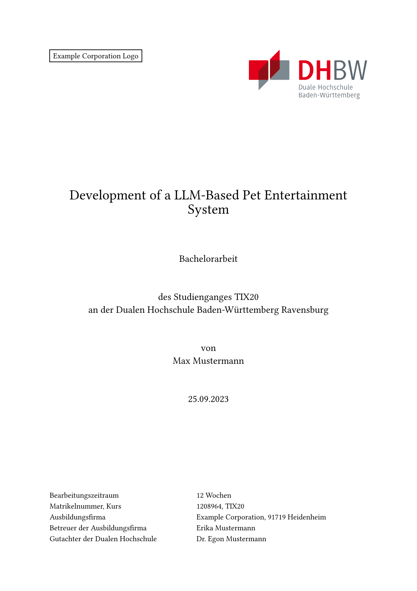

# Typst DHBW Template
This template is my interpretation of the guidelines required by the DHBW Stuttgart and Ravensburg.
I wrote it for my 2023 bachelor thesis, and it is compatible with Typst 0.10.0.

While I am no longer a student at the DHBW, I do accept pull requests and I intend to resolve any issues that might arise in the future.

## Setup
This template requires you to separately download the DHBW Logo.

You can download it from <https://upload.wikimedia.org/wikipedia/de/1/1d/DHBW-Logo.svg> and save it in the same directory the `template.typ` is stored in as `dhbw-logo.svg`.
You may run the following command in said directory to do that:
```sh
curl https://upload.wikimedia.org/wikipedia/de/1/1d/DHBW-Logo.svg -o dhbw-logo.svg
```

## Example
You can check out how this template can be used in the [example.typ](./example.typ) found within this repository.
The following is the first page of that document:


## License
This repository is dual-licensed under the [MIT](https://choosealicense.com/licenses/mit/) and [Apache 2.0](https://choosealicense.com/licenses/apache-2.0/) license.
